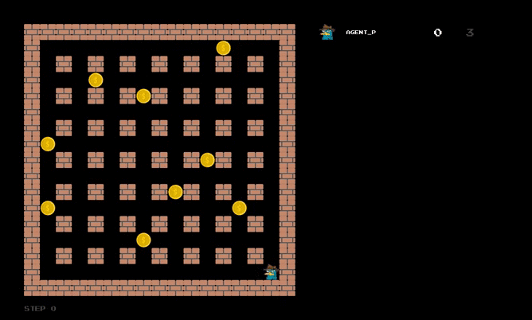

Final project for the course Fudamentals of Machine Learning 2020/2021.  
Code template: https://github.com/ukoethe/bomberman_rl  

  

 

See how Agent P collects coins after being trained with Deep Q-Learning: 

  
 

